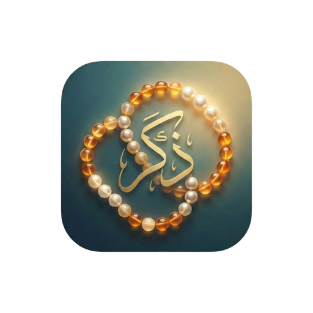

<div align="center">



# Daily Zikr

### Morning & Evening Remembrances

A beautifully crafted Islamic app to help you stay consistent with your daily adhkar.

Built with Flutter. Sourced from the Quran & Sunnah.

[](https://flutter.dev)
[](https://dart.dev)
[](https://daily-zikr-app.web.app)
[](https://github.com/Momin-Abdurrehman/Daily-Zikr/releases)

[**Live Web App**](https://daily-zikr-app.web.app)

</div>

---

## Overview

Daily Zikr is a cross-platform app designed for Muslims who want to build a consistent habit of morning and evening remembrances. It includes **19 authenticated morning supplications** and **19 evening supplications**, each with Arabic text, transliteration, English translation, and virtues - all sourced from **Hisnul Muslim**, **Sahih Bukhari**, and **Sahih Muslim**.

The app respects your time and focuses on what matters: reading your adhkar, tracking your consistency, and nothing else.

---

## Features

<table>
<tr>
<td width="50%">

**Core**
- Morning & Evening Adhkar with full references
- Arabic text with transliteration & translation
- Expandable virtues (Fazail) for each supplication
- Daily rotating Hadith on the home screen
- Hijri calendar date display

</td>
<td width="50%">

**Personalization**
- Add your own custom duas
- Drag-and-drop reordering
- Hide & restore built-in supplications
- Nastaliq or Naskh Arabic font styles
- Toggle transliteration on/off

</td>
</tr>
<tr>
<td>

**Progress**
- Streak tracking for daily consistency
- Completion status for each session
- Automatic daily reset at midnight

</td>
<td>

**Experience**
- Light & Dark mode
- Smart notifications (mobile)
- Optimized mobile web rendering
- PWA support for offline access

</td>
</tr>
</table>

---

## Tech Stack

| Layer | Technology |
|-------|-----------|
| Framework | Flutter & Dart |
| State Management | Provider (ChangeNotifier) |
| Persistence | SharedPreferences |
| Calendar | Hijri + Intl |
| Notifications | flutter_local_notifications (mobile), Firebase Cloud Messaging (web) |
| Hosting | Firebase Hosting |

---

## Project Structure

```
lib/
 |- core/           Constants, theme, and color palette
 |- data/           Static adhkar & hadith datasets
 |- models/         Dhikr and Hadith data models
 |- providers/      AdhkarProvider, SettingsProvider, HadithProvider
 |- screens/        Home, Adhkar List, Settings, Add Custom Dhikr
 |- services/       Notification scheduling
 |- widgets/        DhikrCard, ProgressHeader, DailyHadithCard
```

---

## Getting Started

**Prerequisites:** Flutter SDK 3.10+

```bash
# Clone the repository
git clone https://github.com/Momin-Abdurrehman/Daily-Zikr.git
cd Daily-Zikr

# Install dependencies
flutter pub get

# Run on Chrome
flutter run -d chrome

# Build Android APK
flutter build apk --release

# Build for Web & deploy
flutter build web --release
firebase deploy
```

---

## Version History

**v1.2.0** - Latest
> Improved mobile UX, optimized web performance, refined header layouts, HTML renderer for mobile web, simplified splash screen.

**v1.1.0**
> Hide & restore adhkar, custom dhikr management, web splash screen, reorder persistence.

**v1.0.0**
> Initial release with morning & evening adhkar, daily hadith, streak tracking, dark mode, and notifications.

---

## Design

The app follows an Islamic-inspired design language:

- **Primary Green** `#1B5E20` - rooted in Islamic tradition
- **Accent Gold** `#D4AF37` - reflecting heritage and elegance
- **Cream Background** `#FFF8E7` - warm, easy on the eyes
- **Material 3** with rounded cards and smooth transitions

Arabic text is rendered with dedicated fonts (Noto Naskh Arabic / Noto Nastaliq Urdu) with proper RTL directionality and generous line height for readability.

---

<div align="center">

**Daily Zikr** is a personal project built with sincerity.

*May Allah accept our remembrance and grant us steadfastness.*

---

Made by [Momin Abdurrehman](https://github.com/Momin-Abdurrehman)

</div>
